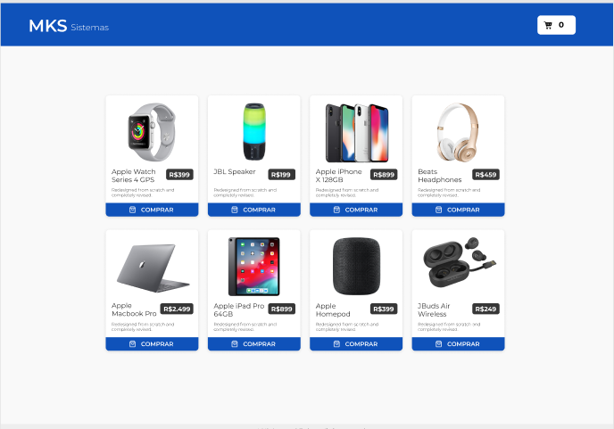

#  MKS Sistemas - E-commerce





# Explicação

O MKS Sistemas é um projeto de e-commerce desenvolvido para proporcionar uma experiência de compra online fácil e intuitiva.

# Funcionalidades Principais

- Lista de Produtos: Exibição de diversos produtos com imagens, descrições breves e preços

- Carrinho de Compras: Funcionalidade para adicionar produtos ao carrinho de compras e gerenciar os itens antes de finalizar a compra.

# Tecnologias

- Next
- TypeScript
- React-query
- SASS
- Framer-motion
- Jest
- Typescript
- Testing-library

# Como usar?
Antes de começar, você precisa ter o Git e o Node instalados.

```bash
# Clone this project
git clone https://github.com/Diegoh-dev/mks-app.git
# access
cd mks-app
# install dependencies
 yarn
# Run the project
$ yarn dev
```
    

# Colaboradores

- Diegoh-dev
